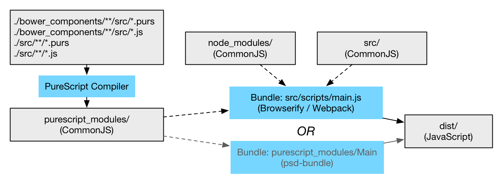

Compilation & Bundling
======================

Before we dig into the language itself and how we actually write some
PureScript code, we'll first look at some infrastructure and how we actually
get our PureScript code into the browser. If that gives you a premonition
because you're familiar with JavaScript build tools, you're right.

There is no dominant best-practice for how to structure your build, in
particular if you're going to use PureScript together with other JavaScript. I
will try to explain what the moving pieces are and show you one way to set
things up, without going through the actual scripts in detail.

The good news is that PureScript is easy to install assuming you have
[`npm`](https://www.npmjs.com/):

    npm install --save-dev purescript

This downloads a binary distribution and installs it in your local NPM project
at `node_modules/.bin/`. (You can also add a -g flag to install it globally).

PureScript uses the same module organistation as Haskell -- each module is a
file named the same as the module, organised hierarchically into folders. It
uses a `.purs` extension for source files by convention. See the `purs/` folder
for an example.

TODO: .purs files

PureScript does not share any infrastructure with Haskell. Instead, it uses the
JavaScript tool [Bower](http://bower.io/) to distribute its libraries.  you can
install bower, list PureScript libraries, and install the `purescript-prelude`
and `purescript-control` libraries:

    npm install bower -g
    bower search purescript-
    bower install purescript-prelude purescript-control

Bower uses a `bower.json` file to save these dependencies, which thus serves
part of the role of a `.cabal` file for a Haskell project.

Now, getting our PureScript code into a browser involves two steps:

1. Compile the PureScript modules (files) into
   [CommonJS](http://wiki.commonjs.org/wiki/CommonJS) modules. Each PureScript
module corresponds to a CommonJS module.

2. Bundle the CommonJS modules into a single JavaScript file suitable for
   inclusion in our HTML. This step can also eliminate dead code in the
CommonJS files (from PureScript).

CommonJS is nowadays, arguably, the most popular module format for JavaScript
because its use in Node. Tools like Browserify or Webpack bundles these modules
into fewer files so that they become suitable for distributing to browsers.
The popularity of CommonJS will likely shift in the future as ECMAScript module
standards gain traction.

Compilation
-----------

To compile our code, we need to tell the compiler where to find:

- PureScript files we've written
- JavaScript files used in foreign function imports in our code
- Library PureScript files
- JavaScript files used in foreign function imports in libraries

If the PureScript compiler is in our `PATH` and our sources are in `./src` we
can invoke the compiler as follows:

    psc          './bower_components/**/src/*.purs' \
        --ffi    './bower_components/**/src/*.js' \
                 './src/**/*.purs' \
        --ffi    './src/**/*.js' \
        --output purescript_modules

This produces a hierarchy of CommonJS modules in `purescript_modules`. (You
would rarely invoke this manually, but instead have the build system do it for
you.)

Bundling
--------

If you're working on a Node program, you can import the CommonJS modules
produced by the PureScript compiler into JavaScript as you would any other.

If you want to run your code in the browser, you want to bundle the modules up
into a single file. This is where things get a bit messy and depending on how
you want to use PureScript you might choose different solutions:

- Browserify or Webpack: standard bundler tools for JavaScript. These will have
  integration to whatever build tool you choose and are well established. The
downside of these is that they do not perform dead code elimination of code
coming from PureScript, which means that the bundle you ship to the browser
will often be larger than it needs to be.

- `psc-bundle`: This is PureScripts bundler that is great at bundling the
  CommonJS output from PureScript and performs dead code elimination. It does
not work with CommonJS modules from other sources however. It's not clear to me
why.

Thus, the unfortunate reality for now seems to be (unless I've missed
something) that if you want to import PureScript modules into your existing
JavaScript, the code-size will be bloated. If you're happy to let PureScript
take the lead and be the main entry point to your code, you can use
`psc-bundle` and have the dead code eliminated.

TODO: Example: Bundle PureScript output using `psc-bundle` and look at the result and
run in a browser. Print a log message. With and without --main? Load in browser.

TODO: Example: Bundle a JavaScript module that imports a PureScript module using
Browserify. Run main to do the same thing?

Diagram
-------

Build
-----

There's a plethora of build tools and corresponding conventions for JavaScript.
We'll use [Gulp](http://gulpjs.com/) and Browserify here, but you should see
this only as an example. It's more important that you understand the PureScript
build products and how they fit into JavaScript development than the precise
setup used here.
