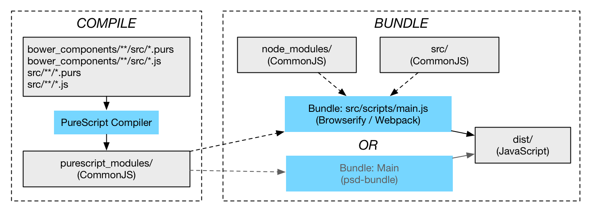

Infrastructure
==============

Before we dig into the language itself and how we actually write some
PureScript code, we'll look at infrastructure around it and how we get our
PureScript code into the browser.

General build tools are outside the scope of this talk. What I'll aim to do
here is explain the pieces involved in using PureScript in the hope that you'll
gain a clear enough picture to integrate PureScript with the build system of
your choice, whether that's [Gulp](http://gulpjs.com/) (check out
[`gulp-purescript`](https://github.com/purescript-contrib/gulp-purescript)),
Grunt, or something else. If you decide to go "all in" with PureScript, have a
look at [Pulp](https://github.com/bodil/pulp).

Installation
------------

PureScript is easy to install assuming you have
[`npm`](https://www.npmjs.com/):

    npm install --save-dev purescript

This downloads a binary distribution and installs it in your local NPM project
at `node_modules/.bin/`. If you want a gloabl installation you can do:

    npm install -g purescript

Modules
-------

PureScript encourages the same module organistation as Haskell -- each module
is a file named the same as the module, organised hierarchically into
directories -- but does not enforce that filenames match module names.
PureScript modules use a `.purs` extension by convention. The modules `Main`
and `Computation.Double` would be written in the following files:

    .
    |-- Computation
    |   `-- Double.purs
    `-- Main.purs

Libraries
---------

PureScript does not share any infrastructure with Haskell. Instead, it uses the
JavaScript tool [Bower](http://bower.io/) to distribute its libraries. You can
install bower with `npm install -g bower`. It can save dependencies to a
`bower.json` file, which peforms part of the role of a `.cabal` file for a
Haskell project.

### Example: List available libraries

    bower search purescript-

### Example: Install the `prelude` and `console` libraries

    bower install --save-dev purescript-prelude purescript-console

Browser applications
--------------------

Getting our PureScript code into a browser involves two steps:

1. *Compile* the PureScript modules (files) into
   [CommonJS](http://wiki.commonjs.org/wiki/CommonJS) modules. Each PureScript
module corresponds to a CommonJS module.

2. *Bundle* the CommonJS modules into a single JavaScript file suitable for
   inclusion in our HTML. This step can also eliminate dead code in the
CommonJS files (from PureScript).

CommonJS
--------

CommonJS is, arguably, the most popular module format for JavaScript because of
its use in Node. It is based around a convention that treats the names
`exports`, `require`, and `module` in a file specially. We can define a module
that imports a `crypto` module and exports a `sha1` function:

    var crypto = require("crypto");
    exports.sha1 = function (data) {
      return crypto.createHash('sha1').update(data).digest('hex');
    };

Tools like Browserify or Webpack can bundle CommonJS modules into fewer files
and make the handling of the special `require`, `exports`, and `module` names
explicit so that they become suitable for distributing to browsers (which don't
know anything about CommonJS).

The popularity of CommonJS will likely shift in the future as the ECMAScript
module standard gains traction.

Compile
-------

To compile PureScript code, we need to tell the compiler where to find:

- PureScript files we've written
- JavaScript files used by us in foreign function imports
- Library PureScript files
- JavaScript files used by libraries in foreign function imports

### Example: Compile PureScript files and inspect the output

From the same directory as this README, we can invoke the compiler as follows,
assuming we've already installed the `purescript-prelude` and
`purescript-console` libraries in the parent directory:

    psc          '../bower_components/purescript-*/**/*.purs' \
        --ffi    '../bower_components/purescript-*/**/*.js' \
                 './src/purs/**/*.purs' \
        --ffi    './src/purs/**/*.js' \
        --output '../purescript_modules'

This produces a set of CommonJS modules in `purescript_modules` that you can
inspect to see how PureScript compiles into JavaScript.

### Example: Run a compiled PureScript program in Node

If you're working with Node, you can import the CommonJS modules produced by
the PureScript compiler into your JavaScript modules directly, as you would any
other CommonJS modules. You probably want to add the `purescript_modules`
directory to your `NODE_PATH` to make this easy. For example:

    NODE_PATH=../purescript_modules:$NODE_PATH node
    > require("Main").main()
    Hello, PureScript
    42
    {}

Bundle
------

If you want to run your code in the browser, you want to bundle the modules up
into a single file. This is where things get a bit messy and your approach will
depend on how you want to use PureScript:

- [Browserify](http://browserify.org/) and [Webpack](http://webpack.github.io/)
  are standard bundler tools for JavaScript. Most build tools have some form of
integrations for these. The downside of these is that they do not perform dead
code elimination for code coming from PureScript, which means that the bundle
you ship to the browser will often be significantly larger than it needs to be.

- `psc-bundle` is PureScripts bundler for CommonJS output from PureScript. It
  performs dead code elimination so produces small output, but does not work
with CommonJS modules from other sources however. (I'm not sure why.)

Thus, for now, if you want to import PureScript modules into your existing
JavaScript, it seems that your files will be bloated. If you're happy to let
PureScript take the lead and be the main entry point to your code, you can use
`psc-bundle` which performs dead code elimination.

### Example: Bundle code using `psc-bundle` and run in a browser
    
If we use `psc-bundle` to bundle our code, we can either produce:

1. A file that creates a global namespace (`PS` by default) when it loads.
2. A file that automatically runs the `main` function of a specified "main"
   module when it loads. We achieve this with the `--main` argument.

For example:

    psc-bundle ../purescript_modules/**/*.js --module=Main -o dist/passive.js
    psc-bundle ../purescript_modules/**/*.js --module=Main --main=Main -o dist/active.js

We can load these in a web-browser and use the console to explore the result:

    cp src/html/*.html dist/
    open src/html/passive.html # Try running PS.Main.main() in the browser console
    open src/html/active.html  # Main.main() will run automatically

If you inspect these files, you'll find that only part of the compiled CommonJS
modules have been included. `psc-bundle` has removed functions that aren't used
from PureScript generated CommonJS modules to reduce the size of the JavaScript
bundle.

### Example: Bundle code using Browserify and run in a browser

    mkdir dist
    cp src/html/*.html dist/
    export NODE_PATH=../purescript_modules/:$NODE_PATH
    browserify src/js/main.js -o dist/browserify.js
    open dist/browserify.html # Main.main() will run automatically

If you inspect the `dist/browserify.js` file, you'll see that this is much
larger because it hasn't had dead code eliminated as discussed earlier.
